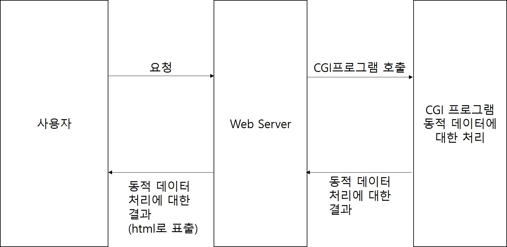
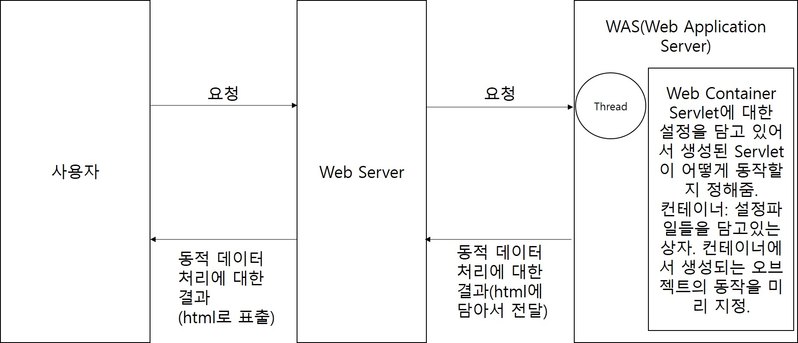
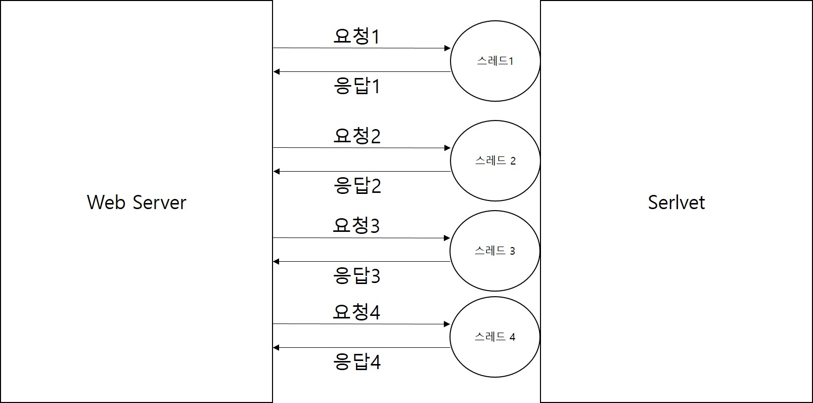
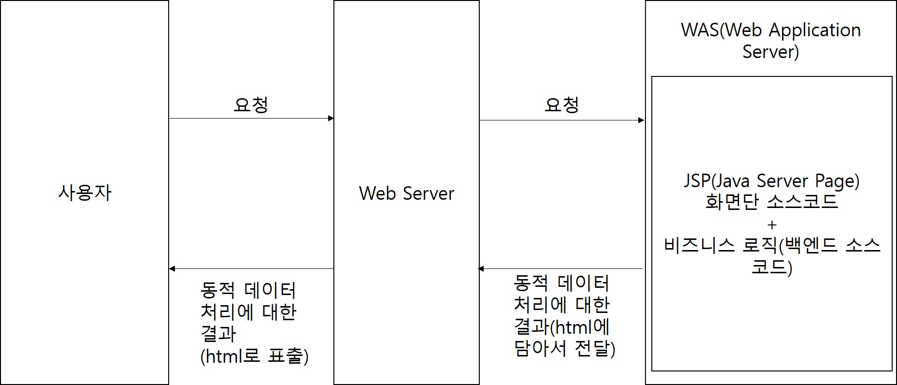
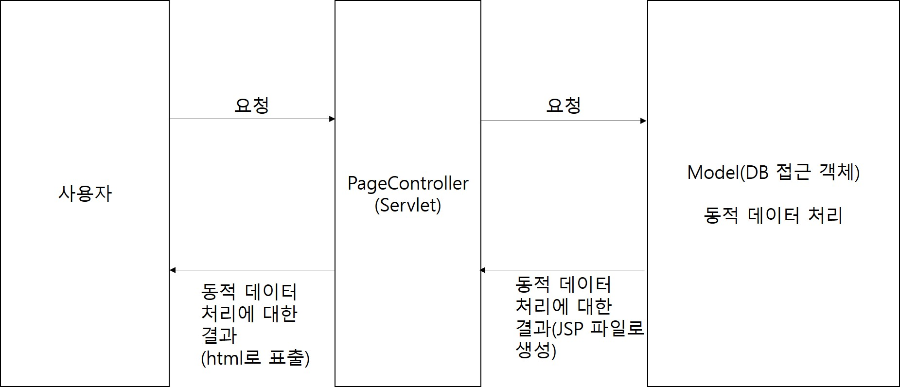
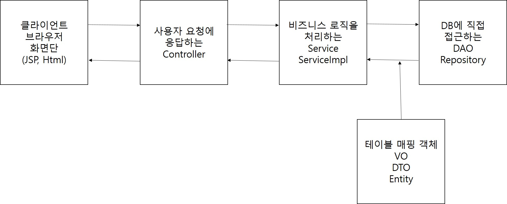
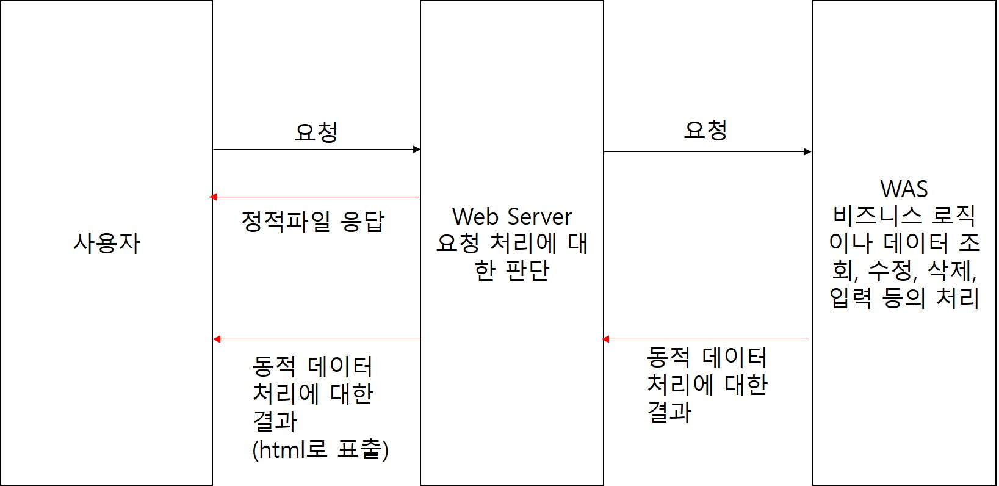
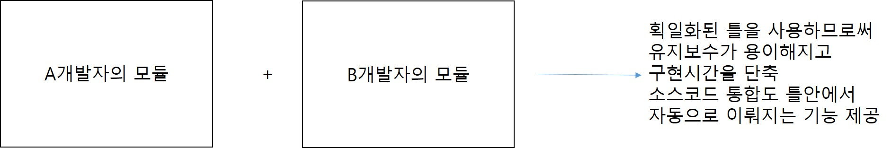

# 1. SpringFramework
## 1. 웹 개발의 역사
### 1. Servlet의 등장 전
1. 초창기 웹은 html, css 파일(정적파일)만 주고받고 할 수 있는 형태의 웹
2. 
3. DB에 있는 데이터를 가져와서 동적으로 표시할 방법이 없는 문제점이 발생 -> 개발자들이 동적 데이터를 표시할 방법을 찾기 시작

### 2. CGI 프로그램
1. CGI(Common Gateway Interface): 동적 데이터 처리에 대한 규약
2. 클라이언트(사용자)가 요청을 보내면 Web서버에서 CGI프로그램을 호출하여 동적 데이터를 처리하는 방식.
3. CGI프로그램은 요청당 하나의 프로세스를 생성하여 동적데이터에 대한 처리를 하였다.
4. 
5. 대형 사이트들이 등장하면서 다수의 사용자에 대한 처리에서 문제가 발생했다.
6. CGI 프로그램이 프로세스 기반이었기 때문에 한 사용자의 요청이 끝나기 전에는 다른 사용자의 요청에 대한 처리를 시작할 수 없었다.
7. 
8. 다수의 사용자가 요청을 보냈을 때 마지막에 요청을 보낸 사용자는 앞의 요청들이 모두 끝날때까지 대기해야하는 문제와 요청당 프로세스를 하나씩 생성하면서 메모리부족과 CPU점유율 증가로 인한 서버PC 중단현상이 빈번하게 발생했다.

### 3. Servlet
1. 위 CGI프로그램의 문제점들을 해결하기 위해 고안된 방식. 요청 당 하나의 프로세스를 생성하지 않고 스레드를 생성해서 멀티 스레드 방식의 병렬처리를 통한 다수의 요청을 처리하도록 구현.
2. Servlet은 자바 코드로 html 태그들을 생성할 수 있다.
3. 
4. 
5. 스레드 기반의 비동기 처리방식이기 때문에 먼저 들어온 요청이 먼저 끝날수도 있고 나중에 들어온 요청이 먼저 끝날 수도 있는 시스템.
6. Servlet의 문제점은 Java코드로 html을 구성하는 게 매우 복잡하고 어려웠다는 점이다.

### 4. JSP(Java Server Page) - Model 1 방식
1. Java 코드로 html을 구성하는 게 비효율적이기 때문에 JSP는 html 웹 문서를 구성하고 그 안에서 Java 코드를 사용할 수 있는 방식.
2. JSP 한 파일에 자바 + Html + Css + JavaScript 소스코드가 모두 존재.
3. JSP는 화면단 소스와 비즈니스 로직(자바에서 처리할 내용)들이 한 파일에 작성되었다.
4. 
5. 모든 소스코드가 JPS에 몰려있다 보니 소스코드가 어지럽고 더러운 문제가 발생했고 소스코드를 분석하기도 쉽지 않았다.

### 5. Model 2 방식(JSP/Servlet 방식)
1. Model1 방식의 소스코드 분석의 문제가 발생하면서 화면단과 비즈니스 로직을 분리하는 Model2 방식으로 발전이 이뤄졌다.
2. 화면단 소스 코드는 JSP가 비즈니스 로직은 Servlet이 처리하는 형태의 방식
3. 현재 제일 많이 사용되는 MVC(Model View Controller)방식의 시초.
4. 

### 6. MVC(Model View Controller) 패턴
1. 모델2 방식이 좀 더 구체화 되면서 발전된 형태의 디자인 패턴
2. 모델2 방식에서는 PageController(Servlet)가 하나만 존재하는 형태에서 MVC패턴에서는 기능별 Controller(일반 Servlet이 아닌 Http프로토콜(규약) HttpServlet(Spring에서 제공해주는)을 상속받아서)를 생성
3. Model(DB 접근 객체: DAO, Repository, 비즈니스 로직: Service, Service를 상속받은 ServiceImpl, 테이블 매핑 객체: VO, DTO, Entity), View(JSP, Html, ...), Controller(Controller(Serlvet을 상속받은))
4. 

## 2. WEB/WAS
### 1. WEB 서버
1. 클라이언트(사용자)의 요청을 가장 먼저 받아주는 서버
2. 요청을 WEB 서버에서 처리할 것인지 아니면 WAS로 전달할 것인지 판단하여 처리. 사용자 요청이 단순 정적파일 요청이라면 WEB 서버에서 바로 사용자에게 정적파일(Html, Css, jpg, png, js, ...)을 보내준다.
3. 컴파일이나 DB에 데이터를 가져오는 로직등 비즈니스 로직이 필요한 경우 사용자 요청을 WAS로 전달. WAS에서 처리된 결과가 WEB 서버로 오고 WEB 서버는 사용자에게 그 결과를 전달해주는 형태.
4. WEB 서버는 기본적으로 80포트를 사용하게 되어있는 데 설정파일에서 변경가능.
5. 많이 사용되는 WEB의 종류는 Apache, IIS, nginx, WebtoB, ... 등이 있다.
### 2. WAS(Web Application Server)
1. 실제로 웹 어플리케이션을 실행하는 서버.
2. 템플릿엔진(JSTL, Thyleaf, ...)이 필요한 경우나 비즈니스 로직인 Java 클래스의 메소드, SQL 쿼리 실행까지 모두 WAS가 담당
3. 사용자 요청이 WAS로 전달되면 Servlet 컨테이너에서 Servlet을 생성해서 요청을 처리.
4. WAS는 기본적으로 8080포트로 동작하며 설정파일에서 변경가능하다.
5. 많이 사용되는 WAS는 tomcat, Web Logic, Jetty, Jeus, ... 등이 있다.
6. 

## 3. SpringFramework
### 1. SpringFramework란?
1. Framework는 뼈대, 골결이라는 뜻을 가지고 있다.
2. SpringFramework는 웹 개발의 뼈대나 골격을 제공하는 역할
3. SpringFramework 등장 전에는 여러명 개발자들이 각각의 스타일대로 개발 진행 -> 특정 한 명의 개발자가 빠지게 됐을 때 유지보수하거나 소스코드의 수정에서 매우 어려움을 겪었다.
4. 각자 스타일대로 개발을 진행하다 보니까 소스코드 통합하는 부분에서도 시간이 많이 소요됐다.
5. 
6. Springframework은 이러한 문제점을 해결하기 위해서 획일화된 웹 개발 뼈대를 제공하는 역할
7. 

